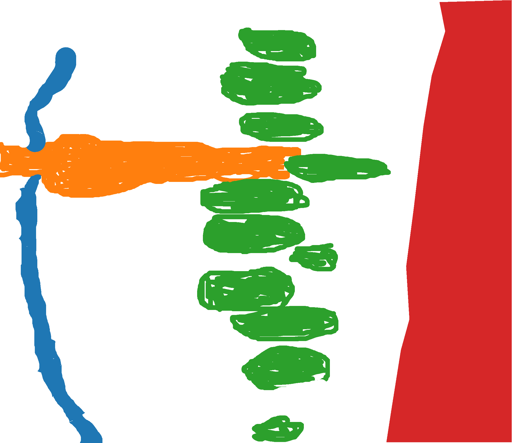
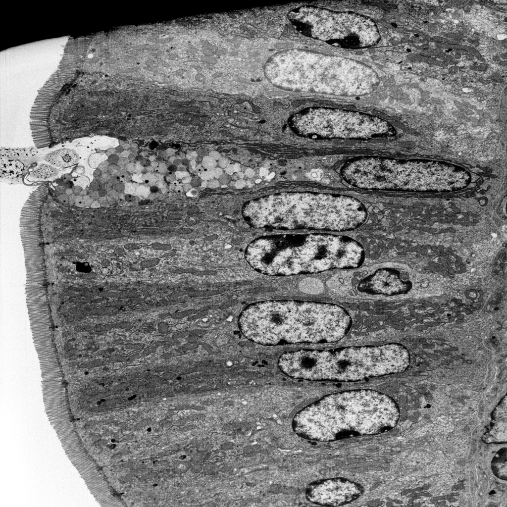

## Images: 
SEM_Image 

## Image Size:
Original size

## Masked Regions:
 - Nucleus (green)
 - Microvilli (blue)
 - Goblet (orange)
 - Basement (red)
 
## Outcome
Job failed because the images were too large. All five images were
 however labeled and some werew labeled quite well. We may be able to use the
 results as a component of our future dataset if we scale them appropriately.
 
 ## Representative Output
 
 
 
 